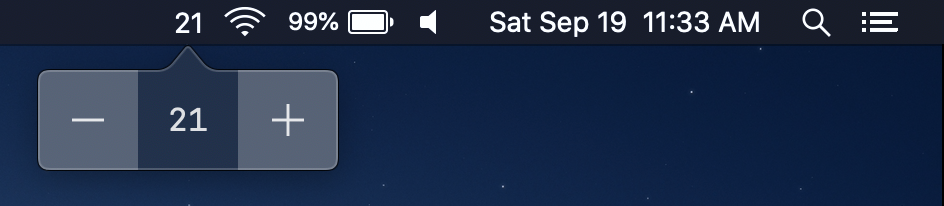
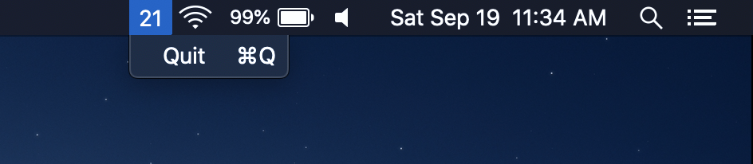

# MCounter

A simple counter utility that lives in the macOS menu bar.

## Features

-   Increment the counter value
-   Decrement the counter value
-   Edit the counter value
-   Quit the app

I said it was simple 🙂

## Installation

Download the latest `.dmg` file from the
[Releases](https://github.com/mnxn/MCounter/releases), open it, and drag the app
into the `Applications` folder.

I haven't paid the yearly fee to be part of "Apple Developer Program" which
results in a scary message when trying to open the app. If you receive the
warning message, you must go to
`System Preference > Security & Privacy > General` and click `Open Anyway`.

## Launching the app on login

To launch the app on login, go to
`System Preferences > Users & Groups > Login Items` and click the `+` button to
find and add the app to the list.

## Screenshots

### Left-Click Menu

### Right-Click Menu

